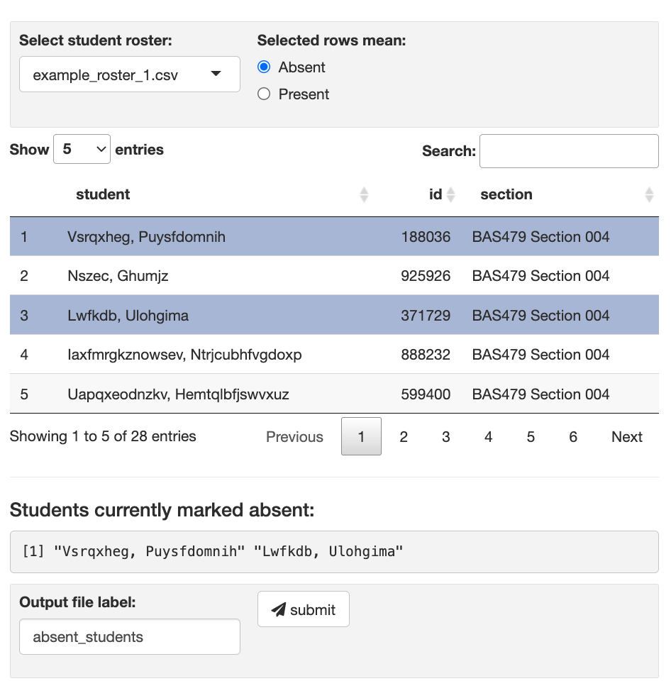

# shiny_attendance

A quick, minimal R Shiny app to demo Shiny and help with attendance

  

## Usage

### Initial setup

* "Clone" this git repo
* Add your student roster as a csv to the `student_rosters` directory (all columns will be displayed; a column named `student` is required)

### Post setup usage

* Launch shiny app
* Select student roster file from drop down
* Click rows to mark as absent/present
  * To select a row simply click on it
  * Use the radio buttons above the table to indicate if selected rows mean present or absent
* Preview students marked as absent in the text output
* Click 'submit' to save the rows of the input marked as absent
  * Saved as a CSV
  * Output file has the "Output file label:" text box and a timestamp as the file name
